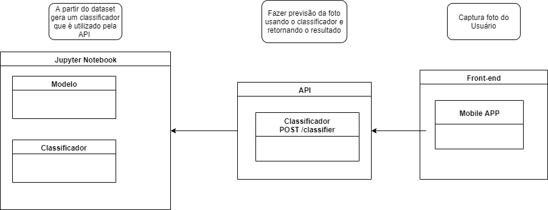

# Documento de Arquitetura

## 1. Introdução
Este documento apresenta a arquitetura de software utilizada no desenvolvimento do Skincare, visando uma visualização dos requisitos e da estrutura com os desenvolvedores.
#### 1.1 Finalidade
Este documento tem como objetivo esboçar uma visão ampla da arquitetura do Skincare e porque cada decisão arquitetural foi tomada.
### 1.2 Escopo
O Skincare possui o intuito de ajudar profissionais e pacientes em pré-exames de doenças de pele, como melanoma, de forma não invasiva e rápida, utilizando-se de ferramentas e técnicas de Machine Learning. 

### 1.4  Definições, Acrônimos e Abreviações
<li> API: Application Programming Interface </li>
<li> Front-end: Trabalha com a parte da aplicação que interage diretamente com o usuário </li>
<li> Back-end:  Trabalha na parte de “trás” da aplicação. Ele é o responsável, em termos gerais, pela implementação da regra de negócio. </li>
<li>CNN: Rede Neural Convolucional</li>

## 2. Representação da Arquitetura

* **Jupyter Notebook**      

&emsp;&emsp;O <i>Jupyter Notebook</i> é um aplicativo Web de código aberto que permite criar e compartilhar documentos que contêm código ativo, equações, visualizações e texto narrativo. Os usos   incluem: limpeza e transformação de dados, simulação numérica, modelagem estatística, visualização de dados, aprendizado de máquina e muito mais.
 

* **Flask**     

&emsp;&emsp;<i>Flask</i> é um micro-framework de Python voltado para construção de APIs. Possui um núcleo simples e expansível que permite que um projeto possua apenas os recursos necessários para sua execução

* **React-Native**

&emsp;&emsp;<i>React-Native</i> é uma biblioteca moderna que permite acessar a interface e os recursos nativos dos smartphones utilizando JavaScript.

* **Expo**     

&emsp;&emsp;<i>Expo</i> é um framework utilizado no desenvolvimento mobile com React Native que permite o fácil acesso às API’s nativas do dispositivo sem precisar instalar qualquer dependência ou alterar código nativo.

* **Docker**

&emsp;&emsp;<i>Docker</i> é um projeto de código aberto que automatiza a implantação de aplicativos dentro de recipientes de software, fornecendo uma camada adicional de abstração e automação de virtualização de sistema de nível operacional em Linux, Mac OS e Windows.

## 3. Metas e Restrições de Arquitetura

&emsp;Restrições de arquitetura do projeto:

<ul>

<li>Utilização da ferramenta <i>Jupyter Notebook</i> para gerar o modelo e treinar a CNN utilizada no projeto.</li>
<li>Utilização da ferramenta <i>Docker</i> para a virtualização de ambientes, voltado para o desenvolvimento da arquitetura de microserviços do projeto.</li>
<li>Utilização do <i>React Native</i> junto com <i>Expo</i> para criação de uma aplicação mobile.</li>
<li>Utilização do <i>Flask</i> para criação de uma API para servir o classificador</li>
<li>Necessário conexão com a internet.</li>

</ul>

&emsp;Metas do projeto:

<ul>

<li>Ajudar os profissionais da área de dermatologia e saúde a fazer um pre-exame sobre a saúde da pele do paciente.</li>

</ul>

## 4. Visão Lógica 

### Arquitetura do Backend

